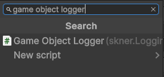
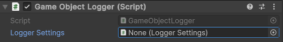

# Game Object Logger

## Overview

The Game Object Logger is a MonoBehaviour that wraps logging functionality. The ideal use cases for this logger are for complex Game Object with several components that benefit from specific logging needs.

For example, the Player object often contains several scripts. These can reference a _GameObjectLogger_, making use of specific Logger Settings.

## Configuring

Being a Unity component, setting this logger up is straight forward. In the selected game object, add a new _GameObjectLogger_ script:



In the Logger Settings field, assign an existing Logger Settings:



_Note: Read more into how to create and configure a Logger Settings instance_ [_here_](../Settings/logger-settings.md)_._

## Using

Once the GameObjectLogger is configured, it can be called in any script from this GameObject with the following code:

```c#
private GameObjectLogger _gameObjectLogger;

void Awake()
{
    _gameObjectLogger = GetComponent<GameObjectLogger>();
}
```

_Note: Although it's dependent on the developer, it's advisable to keep this GetComponent call in the Awake method, so that logging is available in the Start method, if required._

To perform a logging call, reference the GameObjectLogger and call its Log method:

```c#
_gameObjectLogger.LogDebug("Logging a debug message.");
```
