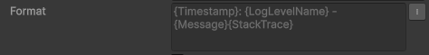
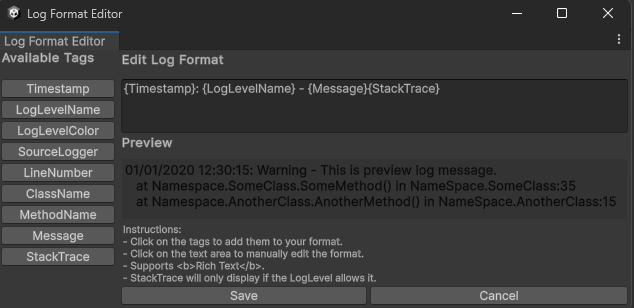

# Log Format

## Overview

The LogFormat is a struct from the package that defines a format for the logs to be constructed against. 

## Usage

The log format allows the developer to easily create a format for the log messages by integrating directly with Unity's Editor. 

When any field or property of type LogFormat is included in any script, a custom PropertyDrawer will be applied:

The button on the right will open a pop up window that allows the developer to add tags and fully customize their log message.

This windows contains the following:
- All the available tags that, when clicked, are added to the Log Format Editor panel.
- A text based log format editor.
- A Preview panel, that converts the log format into an example output in real time.
- Save and Cancel buttons.

The available tags reflect the information gathered by the [LogContext](log-context.md). 