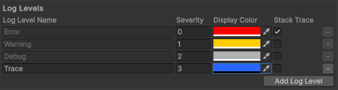

# Log Level Settings

## Overview

Any existing logger has defined log levels, that determine the severity and type of log, providing further context that is not required in the log message.

skner's Logging provides a way to fully create and customize any additional log levels that may be relevant to the project.

This page will describe how to configure log levels and how to use them in any of the available loggers. 


___Disclaimer__: Do not manually edit the LogLevelSettings ScriptableObject. The 3 default levels are mandatory and any unexpected change might result in the package to behave abnormally._

## Configuring

In the project settings, the developer can add new log levels and edit existing ones. Here are the available configuration fields:

| Field                     | Type                          | Description                                            |
|---------------------------|-------------------------------|--------------------------------------------------------|
| `Log Level Name`                 | `string`                        | Name for the log level.                         |
| `Severity`                    | `int`                      | Determines the severity of the log level. This can be used to filter and order log levels.                        |
| `Display Color`                    | `Color`                      | Assigns a color to the log level. Used in Log Formatting.                        |
| `Stack Trace`                    | `bool`                      | Enables or disables stack trace inclusion in the log message.                        |

## Create a new Log Level

Creating a log level, can be as simple as including it in the Project Settings. But there are ways to enhance the integration of this new log level into the project. 

This section will outline to completely create a new log level. As a use case, let's create the 'Trace' log level. 

### Required steps

1. Add the Log Level to the Project Settings and configure it accordingly.

    

2. When logging, call the base Log method, passing the name of the log level:

    ```c#
    GlobalLogger.Log("Trace", "This is a sample trace log message.");
    ```

    _Note that if the passed value for the log level doesn't exist, a Warning will be thrown and the log call will be discarded._

3. Results

    

And that's about it. These are the minimum steps to add a new Log Level, however, the tool provides a way to enhance the integration of this new level with the existing tools. s

### Optional and recommended steps

1. Create a new script called `LoggingServiceExtensions`.

2. Add a static extension method for the interface `ILoggingService`, as follows:

    ```c#
    /// <summary>
    /// Logs a message with the "Trace" log level.
    /// </summary>
    /// <param name="logger">The <see cref="ILoggingService"/> instance used for logging.</param>
    /// <param name="message">The message to log.</param>
    [HideInCallstack]
    public static void LogTrace(this ILoggingService logger, string message) => logger.Log("Trace", message);
    ```

    _Note: Feel free to add the_ [[HideInCallstack](https://docs.unity3d.com/ScriptReference/HideInCallstackAttribute.html)] _attribute, to hide this method from the stack trace._

3. Now, the logging call for the log level Trace can be called directly from any of the existing logger types - GlobalLogger, GameObjectLogger and ClassLogger:

    ```c#
    GlobalLogger.LogTrace("This is a sample trace log message.");
    ```

