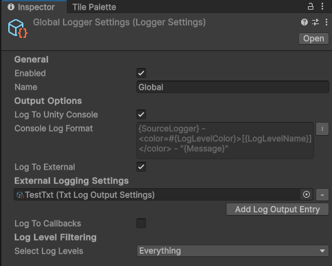
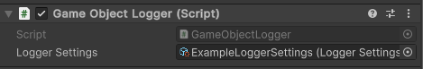

# Logger Settings

## Overview

Configure the behavior of loggers with precision using Logger Settings. Tailor each logger's functionality to meet your project's specific needs.

Each instance will retain individual settings that can then be assigned to different logger instances, to provide flexible configuration, where each logger can share the same settings or have different settings altogether.

This section will detail how to configure and assign logger settings.

## Creating

The Logger Settings are kept as a ScriptableObject that can be created in Unity by going to Assets -> Create -> Logging -> Logger Settings.

## Configuring

Here's a preview of the inspector window:



Here are the settings available:

| Field                   | Type                      | Description                                                                                                                                          |
| ----------------------- | ------------------------- | ---------------------------------------------------------------------------------------------------------------------------------------------------- |
| **General Options**     |                           |                                                                                                                                                      |
| `Enabled`               | `bool`                    | Enables or disables the logger.                                                                                                                      |
| `Name`                  | `string`                  | Specifies a name for the logger.                                                                                                                     |
|                         |                           |                                                                                                                                                      |
| **Output Options**      |                           |                                                                                                                                                      |
| `LogToUnityConsole`     | `bool`                    | Determines whether logs should be sent to the Unity Console.                                                                                         |
| `UnityConsoleLogFormat` | `LogFormat`               | Specifies the [LogFormat](../Models/log-format.md) for Unity Console output. This is only configurable if the `LogToUnityConsole` option is enabled. |
| `LogToExternal`         | `bool`                    | Enables logging to external destinations.                                                                                                            |
| `AssignedLogOutputs`    | `List<LogOutputSettings>` | Configures specific log outputs, such as file or custom destinations. This is only configurable if the `LogToExternal` option is enabled.            |
| `LogToCallbacks`        | `bool`                    | Enables logging to custom callback functions.                                                                                                        |
|                         |                           |                                                                                                                                                      |
| **Filtering Options**   |                           |                                                                                                                                                      |
| `SelectedLogLevels`     | `Bitmask`                 | Represents selected log levels.                                                                                                                      |

## Assigning

The user can assign an instance of the LoggerSettings to any logger:

### GlobalLogger

The GlobalLogger uses a static settings file. These settings can be accessed in the Project Settings. These settings will be automatically injected when the developer calls the GlobalLogger and no further assignment is required. Read more in the [GlobalLogger](../Loggers/global-logger.md) page.

### GameObjectLogger

This component has a single configuration field in the inspector: the logger settings. When using it in any GameObject, simply drag and drop or select an existing LoggerSettings into the Logger Settings field.



Read more in the [GameObjectLogger](../Loggers/game-object-logger.md) page.

### ClassLoggers

This assignment is the most complicated out of the three. The LoggerSettings scriptable object must be loaded with Unity's Resources and passed in the constructor:

```c#
// Assign LoggerSettings to ClassLogger using Unity's Resources
_logger = new ClassLogger(Resources.Load<LoggerSettings>("Logging/ExampleLoggerSettings"));
```

Read more in the [ClassLogger](../Loggers/class-logger.md) page.
