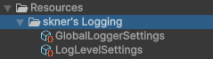

# Installation Guide

This page contains a guide on how to install skner's Logging for any Unity project.

## Installing

### Unity Asset Store

To install this package, simply go to the Unity Asset Store Page. 

#### 1. Add the skner's Logging Package to Unity Assets

Go to the official [Unity Asset Store Page](https://assetstore.unity.com/packages/tools/utilities/skner-s-logging-toolkit-271955).

Click "Add to My Assets"

#### 2. Open skner's Logging in Unity

Click 'Open in Unity', which will automatically launch your Unity Editor and promptly import the package.

#### 3. Ensure global settings are created

After the package has been added, go to your project settings and find the skner's Logging entry. If the resource files were not imported, the panel will display as follows: 

This is because two configuration files are required in the Resources folder for the package to work properly. The location of these two resources is static and cannot be changed.

Click in both buttons to create it and the package will generate these automatically with the default settings. They will be created in the Resources folder of your project:

